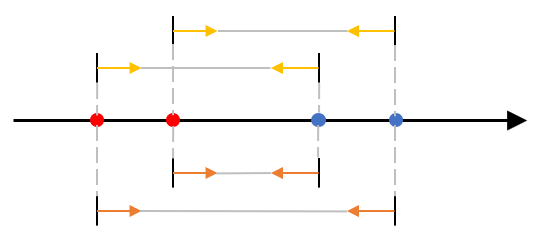

### GYM102431G
#### 题意
在一棵大小为 $n(n\le 2\times 10^5)$ 的树上，结点 $1$ 处有一个标志。两人轮流移动标志，除第一次移动以外，必须保证每次移动的距离严格大于上一次，不能移动者输。求有多少个包含 $1$ 的子图满足在子图上进行游戏时后手必胜。

#### 做法
- 很显然，若结点 $1$ 在树的直径中点上则后手必胜，否则先手必胜。结点 $1$ 在树的直径中点上等价为：$1$ 的子结点中，子树深度最深的两个子结点子树深度相同。
- 首先要求的是 $1$ 的所有子结点的子树中取不同深度的方案数，直接进行普通树上 DP 的时间复杂度为 $O(n^2)$。然而这种以深度为状态的 DP 可以使用长链剖分优化：在长链上转移时，直接改变 dp 数组的首指针即可。长链剖分和重链剖分一样有链上 dfn 序连续的性质，因此可以使用线段树维护区间和，进行 $O(\log n)$ 合并。
- 其次需要根据所求信息计算答案，可以用全体方案数减去最深子树只有一个的情况数。记 $1$ 的子结点集合为 $s$，此时不能直接枚举深度再枚举 $s$ 中所有结点，而是应该根据深度判断需要枚举哪些结点，将枚举次数限制在 $O(n)$ 内。枚举深度时，用线段树维护 $s$ 中结点方案数在深度上的前缀和在位置上的区间积，然后枚举最深的子树位置计算答案即可。

---
### GYM105487F
#### 题意
给定一个长度为 $n(n\le 10^6)$ 的数组 $a(1\le a_i\le 10^6)$，希望创造一个数组 $d$ 使得 $d_i$ 是 $a_i$ 的因数且 $\prod_i d_i=y^2$ 是一个完全平方数。求所有可能的 $d$ 对应的 $y$ 的和。

#### 做法
- 由 $\sum_{i,j}a_ib_j=\sum_i a_i\cdot \sum_j b_j$，发现不同位置、不同质因子对答案的贡献都是独立可拆分的。可以先计算每个位置每个质因数的方案之和再将它们相乘。然而，每个位置方案的合法性并不是独立的，需要保证所有位置的质因数幂之和为偶数。
- 可以将方案之和拆分为奇数幂方案之和以及偶数幂方案之和，进行 DP 转移合并，最后答案即为偶数幂方案的 DP 值。

---
### QOJ7895
#### 题意
给定一棵大小为 $n(n\le 10^5)$ 的树和正整数 $k(k\le n)$，求有多少种分法可以将树分为若干大小为 $k$ 或 $k+1$ 的块。

#### 做法
- 当 $k\le \sqrt{n}$ 时，直接做树上背包即可，时间复杂度为 $O(nk)$。证明如下：将合并过程分为两类，一类是两个都不超过 $k$ 的块合并，这类合并只会发生在大小不超过 $k$ 的最大子树中，相当于对所有不超过 $k$ 的最大子树进行普通 $O(k^2)$ 树上背包，这样的子树不超过 $\frac{n}{k}$ 个，因此这一类合并的时间复杂度 $O(nk)$；另一类是至少有一个块超过 $k$，假设另一个块大小为 $x$，则将 $x$ 个结点合并进来的时间复杂度为 $O(xk)$，因此将整棵树合并进来的时间复杂度为 $O(nk)$。
- 当 $k>\sqrt{n}$ 时，可以发现子树中大小为 $k$ 的块的个数 $a$ 能够直接决定大小为 $k+1$ 的块的个数以及上方剩下的结点数，因此可以以 $k$ 块的个数作为第二维进行树上背包，时间复杂度同样为 $O(nk)$。在实现时可以加一维表示与根相连的块大小是否到达 $k+1$，以防止合并过程中多余结点数到达 $k+1$ 后被视为 $0$ 导致还能继续合并。

---
### CF2037G
#### 题意
给定长度为 $n(n\le 2\cdot 10^5)$ 的序列 $a(2\le a_i\le 10^6)$，若 $i<j$ 且 $\gcd(a_i,a_j)>1$ 则从 $i$ 到 $j$ 有一条有向边。求 $1$ 到 $n$ 的路径条数。

#### 做法
- 记 $dp_i$ 为 $1$ 到 $i$ 的路径条数，则 $dp_i=\sum_{j=1}^{i-1}[\gcd(a_i,a_j)\neq 1]dp_j$
- 记 $s_i=\sum_{i|a_j}dp_j$，枚举 $a_i$ 的所有因数作为 $\gcd(a_i,a_j)$，则 $dp_i=\sum_{d|a_i}\sum_{\gcd(a_i,a_j)=d}dp_j=\sum_{d|a_i}(s_d-\sum_{d<x,d|x,x|a_i}s_x)$。此处 $d$ 的贡献需要减去其所有倍数的贡献，但这不方便快速处理。从上往下考虑，每个 $d$ 的贡献会在其所有因子处被减去，且减完后的因子的贡献还会继续向下影响，但每个 $d$ 的影响范围是固定的，不受 $a_i$ 影响，因此可以进行预处理，算出其对答案影响的系数 $k_d$。此时即有 $dp_i=\sum_{d|a_i}s_dk_d$。
- 预处理系数的方法是：首先将所有值的系数初始化为 $1$，然后从小到大枚举值，将 $i$ 的系数减去 $i$ 的所有因数的系数。

---
### CF2028E
#### 题意
A、B 两人在一棵大小为 $n(n\le 2\cdot 10^5)$ 的树上操纵同一个角色进行游戏。每回合有一半的概率由 A 行动，否则由 B 行动，当一方行动时可以移动角色到相邻结点；角色先到达根结点则 A 胜，先到达叶结点则 B 胜。求角色初始在结点 $i$ 上时 A 获胜的概率。

#### 做法
- 首先记角色在结点 $i$ 上时 A 获胜的概率为 $ans_i$，则双方的最优策略一定是选择 $ans_x$ 最高/最低的相邻结点 $x$ 进行移动；而我们又知道 A 一定会朝根结点方向移动，因此可以推出 B 的策略是向当前子树中最浅的叶结点移动。
- 考虑在一条长度为 $n$ 的链上的情况，假设底端结点到顶端结点的编号分别是 $1,2,...,n$，则 $ans_i=\frac{ans_{i-1}+ans_{i+1}}{2}$。由此可知在一条路径上若 B 的目标叶结点始终不变，则 $ans$ 是自底向上均匀递增的，即 $ans_i=ans_1+\frac{i}{n}(ans_n-ans_1)$。
- 由于 B 的目标叶结点的深度只会越来越浅，为了防止 B 的目标变化，我们可以从浅到深遍历所有叶结点，考虑其上方所有未计算点构成的路径，根据第一个已计算点的答案即可得到路径上所有结点的答案。

---
### CF2038I
#### 题意
有 $n$ 个运动员和 $m$ 个比赛项目 $(nm\le 2\cdot 10^6)$，给定 $0\le a_{ij} \le 1$ 表示运动员 $i$ 是否擅长项目 $j$。比赛开始时，你可以选定一个项目 $x$，让运动员们按照 $x,x+1,...,n,1,...,x-1$ 的顺序进行项目。比拼一个项目时，若此时场上有人擅长该项目，则不擅长的人淘汰；否则没有人淘汰。当场上只剩一人时比赛结束。求假定从每一个项目 $i$ 开始时最终的胜者。

#### 做法
- 注意到比赛过程与字符串比大小过程相同，比赛胜者即字典序最大者。
- 从后往前进行基数排序即可 $O(nm)$ 算出所有答案。

---
### GYM105484B
#### 题意
给定一个长度为 $n(n\le 5\cdot 10^5)$ 的字符串，由 $1,2,3$ 组成。可以对串进行任意次如下操作之一：
1. 选择一个 $2$，将其变为 $0$ 或 $1$
2. 选择两个相邻的 $1$ 并删除
3. 选择两个相邻的 $0$ 并删除

求剩余串可能的最小长度。

#### 做法
- 方法一：将偶数位置的字符取反，则操作变为删除相邻的 $0$ 和 $1$；只要 $0$ 和 $1$ 同时存在就一定有相邻的字符可以删除。因此此时只要贪心地将 $2$ 变为较少的一种字符即可。
- 方法二：记 $dp_{i,j}$ 为前 $i$ 个字符进行操作后剩余字符串以 $j$ 结尾时的可能的长度，不难发现 $dp_{i,j}$ 的取值一定是一个连续的区间：当遇到 $0$ 或 $1$，时，所有取值同时加一或减一；当遇到 $2$ 时，取值由 $[l,r]$ 变为 $[l-1,r+1]$。因此可以 DP 维护 $dp_{i,j}$ 的取值，最终答案即为 $\min(l_{n,0},l_{n,1})$。

---
### P10280
#### 题意
给定两个长度为 $n(n\le 10^6)$ 的二进制串 $s,t$，每次可以交换 $s$ 中距离不超过 $k(k\le n)$ 的两个字符。求使得 $s$ 变为 $t$ 所需要的最小操作次数。

#### 做法
- 首先找到两个集合 $S_1=\lbrace x|s_x=0 \land t_x=1\rbrace, S_2=\lbrace y|s_y=1\land t_y=0\rbrace$，显然 $|S_1|=|S_2|$ 成立，目标即为对两个集合的元素进行匹配，其中匹配 $x$ 和 $y$ 的代价为 $\lceil\frac{|x-y|}{k}\rceil$。
- 以按大小顺序的匹配为基准，记此时的总距离为 $D^{\ast}=\sum_{i}|x_i-y_i|$，可知总距离大于 $D^{\ast}$ 的匹配不可能是最优答案，且总距离不可能更小，因此需要在总距离等于 $D^{\ast}$ 的匹配中寻找答案。而在 $D$ 相同的情况下，依次使得每个 $(|x-y|+k-1)\bmod k$ 最大一定是最优的。
- **保持 $D=D^{\ast}$ 的方法是保持所有元素匹配的方向不变**，如下图。实现的方法是顺序遍历，将暂时无法匹配的元素（一定向右匹配）存入有序集合中，为可以匹配的元素（一定向左匹配）在集合中寻找最佳的匹配对象。

  

---
### CF2041M
#### 题意
给定一个长度为 $n(n\le 10^6)$ 的序列 $a$ 和两种操作：
1. 任选一个前缀进行排序，记前缀长度为 $x$ 则花费的代价为 $x^2$
2. 任选一个后缀进行排序，记后缀长度为 $y$ 则花费的代价为 $y^2$

两种操作可以按任意顺序进行但每种操作最多进行一次。求将整个序列排序需要花费的最小代价。

#### 做法
- 分别考虑两种进行操作的顺序。假设先进行操作 1 ，枚举操作 1 中选择的前缀的长度，此时序列与目标有序序列的最小公共前缀不需要再排序，剩余的后缀可能需要再进行操作 2。
- 因此关键问题是求排序前缀 $x$ 后序列与目标序列的最小公共前缀。**这实际上与前缀 $x$ 中所有元素对应到目标序列中的位置的 MEX 有关**。因此我们只要维护当前前缀的 MEX 即可。不过当 MEX 恰好等于 $x+1$ 时，还需要维护右侧第一个需要改变位置的元素，可以类似双指针均摊 $O(1)$ 维护。
- 先进行操作 2 的情况同理。

---
### GYM105484G
#### 题意
【交互题】给定一棵大小为 $n(n\le 10^5)$ 的二叉树，二叉树中有一个特殊结点。每次可以选择两个结点 $u,v$ 并询问特殊结点距离 $u$ 更近还是距离 $v$ 更近还是一样近，最多进行 $\lfloor \log_2 n\rfloor$ 次询问。求特殊结点是哪一个。

#### 做法
- 根据询问次数限制，我们考虑每次将猜测范围至少缩小一半，即每次询问需要将猜测范围从 $x$ 缩减到 $\lfloor \frac{x}{2}\rfloor$ 及以下。
- 注意到，询问两个结点 $u,v$ 与询问 $u,v$ 连线中点两侧最近的结点得到的结果是相同的，因此可以只考虑询问相邻的点或询问距离为 $2$ 的点。同时还可以发现，猜测范围必定永远是连通的。
- 考虑询问距离为 $2$ 的点，此时根据询问结果的不同，剩余的部分分别可能是切断两点之间的边后形成的三块。我们希望这三块的大小都不超过当前猜测范围结点数的一半。如果有一块超过，我们总是可以移动询问的目标，使得较大的块拆成两份，其余的两块合并，此时合并得的块一定符合要求。由此可知，当猜测范围有至少三个结点时，一定存在一对距离为 $2$ 的结点可以询问使得猜测范围至少缩小一半。最后再特判一下猜测范围大小为 $2$ 的情况即可。
- 在实现时，可以枚举所有结点，此时询问的结点对可能是左子和父/右子和父/左子和右子。

---