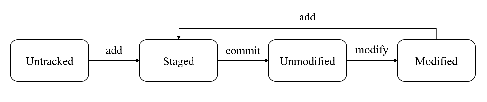

## 简介
Git 是一个**分布式**的版本控制系统。分布式版本控制系统相较于集中式有以下特点：
1. 可以在本地进行提交、分支，而无需联网
2. 每个开发者都有完整的仓库副本，都可以在中央服务器崩溃时恢复整个项目

Git 和其他版本控制系统的主要区别在于，Git 对文件版本的管理并不是基于差异的，而是直接记录文件快照。

而 Github 是一个代码托管云平台，使用 Git 作为底层版本控制工具，允许用户将他们的 Git 仓库托管在云端作为**远程仓库**，并提供了一系列工具方便开发者间远程协作。

## 概念
### 工作区域
Git 的四大工作区域分别是：
1. **工作目录**（Working Directory）：实际进行代码开发的地方
2. **暂存区**（Staging Area）：也称为索引（Index），位于工作目录下 `.git/index` 中，用于临时存放未提交的改动
3. **本地仓库**（Local Repository）：位于工作目录下 `.git` 中，存放完整的项目历史记录
4. **远程仓库**（Remote Repository）：位于远程服务器上，存放完整的项目历史记录

工作区之间的工作流：
<div style="text-align: center;">
  
</div>

### 文件状态
Git 中文件的状态分为未跟踪、已跟踪两种，其中已跟踪又细分为未修改、已修改、已暂存三种：
1. **未跟踪**（untracked）：工作目录中新建的文件，还未参与版本控制
2. **未修改**（Unmodified）：与本地仓库中一致
3. **已修改**（Modified）：与本地仓库中不一致且未暂存修改
4. **已暂存**（Staged）：与本地仓库中不一致但已暂存修改

<div style="text-align: center;">
  
</div>

### 版本和分支
Git 中每个结点代表一个版本，所有版本及其衍生关系构成描述整个项目历史版本的 DAG
- 结点：仓库每一次更新都会生成一个新结点，每个结点都有一个唯一对应的 SHA-1 哈希值
- 分支：指向任意一个结点的指针，代表一个开发工作流
- HEAD：指向本地仓库当前所处分支的指针，唯一存在
- 标签：指向任意一个结点的指针，是对结点的一种静态标记

## 指令
### 创建本地仓库
本地仓库有两种来源，分别是从远程获取或从本地创建
- `git clone <URL>`：将远程仓库复制到本地，并自动创建对远程仓库的引用，命名为“origin”
- `git init`：将本地目录作为工作目录创建本地仓库

### 暂存和提交修改
- `git add <文件路径>`：暂存某一文件的修改
- `git add .`：暂存所有文件的修改
- `git commit -m <提交信息>`：将暂存提交到本地仓库
- `git commit --amend`：往上次提交中补充内容

### 撤销和回退修改
需要注意撤销任何未提交的修改的行为都是危险的，因为不可逆
- `git reset HEAD <文件路径>`：撤销某文件暂存（从已暂存变为已修改）
- `git checkout -- <文件路径>`：撤销某文件修改（从已修改变为未修改/已暂存）
- `git reset <提交>`：回退到某个结点
  - `--mixed` （默认选项）重置 HEAD 和暂存区，但不修改工作目录（仅保留工作目录修改）
  - `--soft` 仅重置 HEAD，不修改暂存区和工作目录（保留工作目录和暂存区修改）
  - `--hard` 重置工作目录和暂存区，完全恢复到目标状态（不保留）
- `git revert <提交>`：创建一个新的提交以撤销目标提交的修改

> <提交> 可以是哈希值/分支名/HEAD/标签名等

### 查看本地信息
- `git status`：查看工作区和暂存区当前的文件状态
- `git log`：查看提交历史，`--oneline` 开启简洁模式
- `git diff`：比较工作区和暂存区的所有差异
- `git diff <文件路径>`：比较某文件的差异

### 管理分支
- `git branch`：查看所有本地分支，`-r` 查看远程分支，`-a` 查看所有分支
- `git branch <分支名>`：创建本地分支
- `git branch -d <分支名>`：删除本地分支（可能产生悬空结点）
- `git checkout <分支名>`：切换 HEAD 指针位置，同时更新工作目录（但保留修改和暂存），`-b` 创建并切换

### 拉取远程仓库更新
拉取远程仓库可以使用 pull 或 rebase，其中 pull = fetch + merge，而 rebase 和 pull 的区别在于会将两个分支合并为一条链，使得提交记录更为优雅
- `git pull <仓库名>`：将远程仓库所有分支更新并合并到本地分支，仓库名可省略，使用默认仓库
- `git pull <仓库名> <分支名>`：将远程仓库的某一分支更新合并到本地分支
- `git pull <仓库名> <分支名1>:<分支名2>`：将远程仓库分支1更新合并到本地分支2
- `git fetch <仓库名> <分支名>`：将远程仓库的分支更新到本地仓库
- `git merge <分支名>`：将本地仓库的分支合并到当前分支上

### 推送本地仓库更新
- `git push <仓库名>`：将本地仓库所有分支更新并合并到远程分支，仓库名可省略，使用默认仓库
- `git push <仓库名> <分支名>`：将本地仓库的某一分支更新合并到远程分支
- `git push <仓库名> <分支名1>:<分支名2>`：将本地仓库分支1更新合并到远程分支2

### 管理关联的远程仓库
本地仓库只有和远程仓库关联后才可以 `pull` 和 `push`，本地仓库中会存储所关联的远程仓库的引用
- `git remote`：查看关联的远程仓库，`-v` 显示 URL
- `git remote add <引用名> <URL>`：关联一个远程仓库
- `git remote show <引用名>`：查看远程仓库信息
- `git remote rename <引用名1> <引用名2>`：更改远程仓库引用名
- `git remote remove <引用名>`：移除远程仓库关联

### 管理标签
- `git tag`：查看所有现有标签
- `git tag <标签名> <提交>`：在某提交上创建标签，提交可省略，默认为 HEAD
- `git tag -a <标签名> -m <标签信息>`：创建附注标签
- `git tag -d <标签名>`：删除本地标签
- `git push origin :refs/tags/<标签名>`：（删除本地标签后）删除远程标签
- `git show <标签名>`：查看标签信息
- `git push origin <标签名>`：推送标签
- `git push origin --tags`：推送所有标签

## 规范
### 提交
Git 的提交信息通常按照格式 `<提交类型>(<影响范围>): <提交目的>` 来填写，其中影响范围可以省略。

提交类型包含以下几种
- `feat`：新功能
- `fix`：修复问题
- `docs`：文档更新
- `style`：代码格式
- `refactor`：代码重构
- `perf`：性能优化
- `test`：添加或更新测试
- `build`：构建系统或外部依赖项的更改
- `ci`：持续集成相关的变动
- `chore`：其他不修改 src 或测试文件的更改
- `revert`：回滚某次提交

### 分支
Git 仓库通常使用“master”或“main”作为主分支，代表稳定的发布版本，其他分支都由主分支产生，最终合并到主分支。

其余的分支包括
- `develop/...`：由主分支产生，用于开发过程
- `feature/...`：由 develop 分支产生，用于开发具体功能特性
- `release/...`：由 develop 分支产生，用于发布版本前进行最后的测试和更新
- `hotfix/...`：由主分支或 release 分支产生，用于修复紧急问题，修复完毕后合并回原分支并删除

### .gitignore
Git 仓库根目录下通常有一个文本文件 `.gitignore`，用于描述不需要跟踪的文件或目录。

`.gitignore` 使用的语法称为 **glob 模式**，是一种简化版的正则表达式，通常在 shell 中使用
- `#` 表示注释
- `*` 匹配零个或多个字符
- `**` 匹配任意多级目录
- `?` 匹配任意单个字符
- `[abc]` 匹配方括号中任意单个字符
- `!` 表示不匹配某种字符串
- 开头的 `/` 表示相对根目录的路径，若开头没有 `/` 没有则匹配任意位置
- 结尾的 `/` 表示匹配目录而非文件

举个例子：
```shell
# 忽略 docs 目录下及子目录中除了 Readme/readme 外所有 markdown 文件
docs/**/*.md
![Rr]eadme.md

# 忽略所有一级子目录下的所有单字符名文件或目录
/*/?
```

---