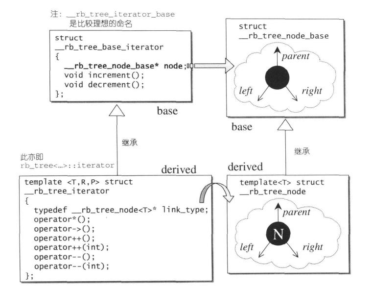

## 第一章 - STL概论与版本简介
- STL标准模板库提供六大组件：容器（containers）、算法（algorithms）、迭代器（iterators）、仿函数（functors）、配接器（adapters）、配置器（allocators）。它们间的交互关系为：**容器**通过**配置器**取得数据储存空间，**算法**通过**迭代器**存取**容器**内容，**仿函数**可以协助**算法**完成不同的策略变化，**配接器**可以修饰或套接**仿函数**。

## 第二章 - 空间配置器
- 空间配置器是隐藏在所有容器背后负责配置空间的组件。

- 在使用容器时，我们通常不需要自己制定配置器，因为 STL 的每一个容器都已经指定了缺省空间配置器。

- 我们常用的 new operator 和 delete operator 都包含两个过程：
  1. 调用 operator new/operator delete 配置/释放内存空间
  2. 调用对象的构造函数/析构函数。
   
  为了精密分工，STL 配置器将这两个过程区分开来：内存的配置与释放由 `alloc::allocate()` 和 `alloc::deallocate()` 负责，对象的构造和析构由 `::construct()` 和 `::destroy()` 负责。

- `construct()` 使用运算子 placement new，在指定位置构造对象。
    ```cpp
    template<class T1, class T2>
    inline void construct(T1* p, const T2& value) {
        new(p) T1(value); //placement new
    }
    ```

- `destroy()` 有两个版本。第一个版本接受一个指针，调用单个对象的析构函数；第二个版本接受两个迭代器，意在批量析构一连串对象。但如果两迭代器指代的范围较大，一次次地调用无意义的构造函数将严重影响效率。所以第二版本使用 traits 技法（第三章）判断元素的数值型别，来决定如何操作。若该型别有 non-trivial destructor，则循环调用所有 destructor，反之则什么也不做。另外，第二版本还针对 char*、wchar_t* 型迭代器提供了特化版本。
    ```cpp
    //第一版本
    template class<T>
    inline void destroy(T* pointer) {
        pointer->~T(); //调用析构函数
    }

    //第二版本
    template<class ForwardIterator>
    inline void destroy(ForwardIterator first, ForwardIterator last) {
        __destroy(first, last, value_type(first)); //获得first对应数值型别
    }

    //特化版
    inline void destroy(char*, char*) {}
    inline void destroy(wchar_t*, wchar_t*) {}
    ```

- SGI STL 对空间配置与释放的设计理念是：
  - 向 system heap 要求空间
  - 考虑多线程状态（本书不讨论）
  - 考虑内存不足时的应变措施
  - 考虑过多“小型区块”可能造成的“内存碎片”问题

- 小型区块不仅会带来内存碎片（fragment）问题，还会带来管理内存需要额外负担（overhead）的问题。为了应对小型区块带来的问题，SGI STL 设计了双层级配置器：
  - 第一级配置器直接使用 `malloc()` 和 `free()` ，并在系统内存空间无法满足需求时，调用一个客端指定的函数（“内存不足处理例程”）进行处理。
  - 第二级配置器则视情况采取不同策略。如果需要的区块较大，超过 128bytes，就移交第一级配置器处理；如果需要的区块较小，就使用内存池（memory pool）管理，称为次层配置（sub-allocation）。
    > 内存池是指在真正使用内存之前先分配一大块内存来形成一个“池”，留作备用。当有新的内存需求时，就从内存池中分出一部分内存块；若内存块不够，则再继续申请新的内存。这样做能够显著提升内存分配的效率。
  - 次层配置方法：第二级配置器基于内存池维护16个自由链表（free-lists），各自管理大小分别为 8，16，24，...，128bytes 的小额区块。当客端释还小额区块时，就由配置器回收至对应链表中；当有小额区块的需求时，配置器主动将需求量上调至8的倍数，并从对应链表中调取一块区块。但为了管理维护链表，每个节点需要一块指针域。为了避免这样的内存浪费，STL利用了 C++ 作为非强类型语言而特有的常用技巧 union 。让每个节点一物二用：既可以是指向下一节点的指针，又可以是指向实际区块的指针。
    ```cpp
    //自由链表节点结构
    union obj {
        union obj* free_list_link; //未被分配时作指向下一节点的指针
        char client_data[1]; //被分配后作指向实际区块的指针
    }
    ```
    当有小额需求时，若自由链表中已经没有区块可用，它将从内存池中获取空间以增加节点。此时若内存池空间足够，则新增 20 个节点；若内存池空间不足但还能提供若干个节点，则新增相应数量节点。若内存池剩余空间已不足供给一个节点，则内存池会利用 `malloc()` 从堆空间（heap）中配置需求量两倍的内存，再附加一块随配置次数增加的附加内存。若 system heap 空间也不够了，则会先在有更大区块的自由链表中寻找，未找到再调用第一级配置器，利用 out-of-memory 处理机制，看是否有机会释放其他的内存拿来此处使用。最后如果还是失败，则抛出异常。

- 除 `construct()` 和 `destroy()` 外，还有三个内存基本处理函数： `uninitialized_copy()` 、 `uninitialized_fill()` 、 `uninitialized_fill_n()` 。
  - 它们分别对应 STL 算法中的 `copy()` / `fill()` / `fill_n()`（第六章）。
  - 它们可以在实现容器区间构造时被使用，将内存的配置与对象的构造行为分离开来。
  - 它们都具备“*commit or rollback*”语义，即要么构造出所有必要元素，要么不构造任何东西——若任何一个构造抛出异常，它们必须析构所有已产生的元素。
  - 在实现时，它们先使用 traits 技法（第三章）判断元素的数值型别是否为 POD（Plain Old Data）型别，也就是标量型别（scalar type）或传统的 C 结构体型别。POD 型别必定拥有 trivial constructor/destructor/copy/assignment 函数，因此可以对 POD 型别采用最有效率的初值填写手法，而对 non-POD 型别采取最保险安全的做法。

## 第三章 - 迭代器概念与 Traits 编程技法
- STL 的中心思想在于，将容器与算法分离，彼此独立设计，最后再以一帖胶着剂将它们撮合在一起。而迭代器就扮演着这一胶着剂角色。《Dessign Patterns》一书对于 iterator 模式的定义如下：
  > 提供一种方法，使之能够依序巡访某个聚合物（容器）所含的各个元素，而又无需暴露该聚合物的内部表述方式。
  
  迭代器是一种行为类似指针的对象，其最常见的行为就是**内容提领**和**成员访问**。所以设计迭代器时最重要的工作就是重载 `operator*` 和 `operator->`。

- 在算法中运用迭代器时，很可能会需要知道与迭代器相关的对象类型，即**相应型别**（associate type） ，例如迭代器所指之物的类型 value_type 。但 C++ 不是强类型语言，无法直接地获得一个对象的类型。所以我们需要利用 template 的**参数推导机制**以及**内嵌类型声明**的技巧，“萃取”出相应型别。这就是 **traits 编程技法**。
    ```cpp
    //参数推导机制举例
    template<class I>
    inline void func(I iter) {
        func_impl(iter, *iter); //将func的工作移往func_impl
    }
    template<class I, class T>
    void func_impl(I iter, T t) {
        T tmp; //成功推导出T，即迭代器所指之物的类型
        //...此处为func()原本应做的工作
    }
    //参数推导机制只能推导参数类型，而不能推导函数返回值类型
    //然而声明内嵌类型可以解决这个问题
    
    //内嵌类型声明举例
    template<class T>
    struct MyIter {
        typedef T value_type; //内嵌类型声明
        T* ptr;
        MyIter(T* p = 0): ptr(p) {}
        T& operator*() const { return *ptr; }
    }
    template<class I>
    typename I::type_value func(I ite) { return *ite; }
    //typename I::type_value即为I所指之物类型，可作为返回值类型
    ```
    然而这两个技巧还无法完美解决问题。首先，STL 以及整个泛型思维都必须接受**原生指针**作为一种迭代器，而原生指针无法定义内嵌类型。其次，对于指向常数对象的指针 pointer-to-const，我们期望得到的 value_type 是 non-const 型别而不是 const 型别。为了解决这两个问题，我们还需要针对普通原生指针和指向常数的指针为泛化的 traits 方法提供**偏特化**版本。要想进行偏特化，首先需要将“萃取”过程交给一个 class template 来专门完成。
    ```cpp
    //专用于“萃取”迭代器特性的class
    template<class I>
    struct iterator_traits {
        typedef typename I::value_type value_type;
    }
    //如果I定义了自己的value_type，就可以被其“萃取”出来
    ```
    这样做让过程多了一层间接性，也使得偏特化可以在 iterator_traits 上进行。
    ```cpp
    //针对原生指针的偏特化
    template<class T>
    struct iterator_traits<T*> {
        typedef T value_type;
    }

    //针对pointer-to-const的偏特化
    template<class T>
    struct iterator_traits<const T*> {
        typedef T type_value; //T为non-const型别
    }
    ```

- 迭代器的五大相应型别为：value_type、difference_type、pointer_type、reference_type、iterator_category。为了符合规范，任何迭代器都应提供五个内嵌相应型别，否则可能无法与 STL 其他组件顺利搭配。
  
- iterator_catagory：根据移动特性与施行操作，迭代器被分为五类。
    - Input Iterator：所指对象不允许改变，只读
    - Output Iterator：所指对象不允许改变，唯写
    - Forward Iterator：可进行读写操作和单向迭代
    - Bidirectional Iterator：可双向移动
    - Random Access Iterator：涵盖所有指针算术能力

  <div style="text-align: center;">
    
  </div>

- 设计适当的相应型别是迭代器的责任，而设计适当的迭代器则是容器的责任。因为只有容器本身才知道应该设计出怎样的迭代器来遍历自己，并执行迭代器该有的各种行为。这也解释了为什么每一种 STL 容器都有自己的专属迭代器。至于算法，完全可以独立于容器和迭代器之外自行发展。

## 第四章 - 序列式容器
- 序列式容器包含 C++ 语言本身提供的 array 和 STL 另外提供的 vector、list、deque、stack、queue、priority_queue。其中 stack 和 queue 由于只是将 deque 改造而成，技术上被归类为一种配接器。

- vector：
  - vector 与 array 的唯一差别在于对空间运用的灵活性，所以 vector 实现的关键在于空间扩充。
  - vector 维护的数据结构是一个**连续线性空间**，直接使用普通指针作为迭代器，支持随机存取。所以 vector 提供的迭代器类型是 Random Access Iterators 。
  - vector 在每次空间不足时会重新配置一块**大小为原空间两倍**的空间并将所有数据转移到新空间内。这样可以保证插入 $n$ 个元素的总时间复杂度为 $O(n)$。需要注意，引起空间重新配置时，原来的所有迭代器都会失效。
  - vector 在 `pop_back()` 以及 `clear()` 等操作时会使用 `destroy()` 以调用元素对象的析构函数，但不会释放空间。
  - vector 的其他操作实现原理等同于对线性数组的操作。

- list：
  - list 是一个**双向链表**，其内部维护一个**带尾空白节点的双向循环链表**，符合 STL 的“**前闭后开**”要求。
  - list 的迭代器需要前移、后移，属于 Bidirectional Iterators ，因此不能直接使用普通指针。无论如何进行插入和接合操作，list 的迭代器都不会失效。
  - list 有一个 list_node_allocator ，专门用以更方便地一次性配置一个节点的空间。
  - list 的 `insert()` 操作会将新节点插入**目标节点的前方**，这符合 STL 的插入操作标准规范。
  - list的 `splice()` 操作可以 $O(1)$ 地进行区间接合。
  - list 不适用 STL 的 `sort()` ，但有自己的 `sort()` 成员函数，采用算法为**快速排序**。

- deque：
  - deque 是一个**拥有双向开口**的**连续线性空间**。deque 不具有“容量”概念，因为它内部动态地以分段连续空间（称为缓冲区，可以指定大小，默认为 512b）组合而成，随时可以增加并链接一段新空间。
  - deque 采用一段连续空间作为主控（中控器），称为 map（与 STL 的 map 容器无关）。
    - map 中每个元素都是**指向一段连续线性空间的指针**。
    - map 中的元素**从最中央开始**向两边扩展，以便同时处理在 deque 两边插入元素的情况。
    - map 在空间不足时的扩充手段与 vector 类似。
  - deque 的迭代器属于 Random Access Iterator，但为了在多段连续空间上维护整体连续的假象，不能使用普通指针。deque 的迭代器保存的信息有：当前元素指针、当前缓冲区头指针、当前缓冲区尾指针、当前缓冲区对应中控器中节点的指针。这些信息配合 deque 中的 start 和 finish 迭代器，即可实现 $O(1)$ 随机访存。
  - deque 自行定义了两个专属空间配置器：data_allocator、map_allocator。
  - deque 在移除元素时，若缓冲区已空，将会释放缓冲区（除非只剩最后一个缓冲区）。
  - deque在进行 `insert()` 和 `erase()` 操作时，将会根据插入位置前后元素数量判断数据移动策略。

- stack：
  - stack 不属于容器，而属于配接器，因为它是通过修改底部容器的接口实现的。
  - stack 默认以 deque 作为底部结构，封闭其头端开口，只允许存取顶部元素，且不允许遍历，因此也没有迭代器。
  - 除 deque 外，stack 也可以以 list 为底部容器。
    ```cpp
    //定义以list为底部容器的stack
    stack<int, list<int>> stk;
    ```

- queue：
  - queue 同样也是一种配接器，性质与 stack 几乎一致，唯一差别在于 queue 双向开口。

- heap/priority_queue：
  - heap 不属于 STL 容器组件，但它负责作为 priority_queue 的底层机制。heap 以 vector 为底层容器，性质和相应算法与数据结构中的 heap 一致，此处略。heap 默认为大根堆。

## 第五章 - 关联式容器
- STL 标准中的关联式容器包含 set、multiset、map、multimap，它们都是由红黑树 RB-tree 实现的。
  > 笔记作者补充：C++11 还提供了基于散列表 hashtable 的 unordered_map 和 unordered_set 。

- RB-tree：
  - RB-tree也是 STL 中的独立容器，原理与数据结构中的 RB-tree 相同，但并不开放外界使用。
  - RB-tree 定义了专属空间配置器，可以一次性配置一个节点的空间。
  - RB-tree 的节点包含实值 value 和键值 key，其中 key 是节点间进行比较的依据。
  - 为了简化边界情况的处理，SGI STL 特别为根节点再设计了一个父节点，称为 header，其左子节点指向最左节点，右子节点指向最右节点。
  - RB-tree 的迭代器属于 Bidirectional Iterators。为了更大的弹性，RB-tree 的迭代器实现与 RB-tree 的节点实现分为对应的两层。

  <div style="text-align: center;">
    
  </div>

  - RB-tree 的插入有 `insert_equal()`（可重复，插入相同值的最右方）和 `insert_unique()`（不可重复，若已有则不插入）两种。

- set：
  - set 中元素的 value 和 key 是等同的，不像 map 那样可以同时拥有 value 和 key。set 不允许两个元素拥有相同的 key 。我们不可通过 set 的迭代器改变元素的值，因为改变元素值的同时也改变了 key ，会破坏 set 内部的组织和有序性。也因此，set 的迭代器为 constant iterator。
  - STL 为 set/multiset 提供了一些集合算法：`set_intersection()` 、 `set_union()` 、 `set_difference()` 、 `set_symmetric_difference()`（第六章）。

- map：
  - map 的所有元素都是 pair，pair 中的第一元素为 key，第二元素为 value。map 不允许两个元素拥有相同的 key。我们可以修改 map 元素的 value，但不可以修改其 key。

- multiset/multimap：
  - multiset/multimap 与 set/map 几乎相同，唯一区别在于插入时调用的是 `insert_equal()` ，即允许多个元素拥有相同的 key。

- hashtable：
  - SGI STL 的 hashtable 采用**开链法**处理哈希冲突。它维护一个基于 vector 的表，表中元素称为桶节点（bucket）。每个桶节点并不采用 STL list，而是自行维护一个由 hashtable node 组成的单向链表。
  - hashtable 以质数作为表格大小，它提前将 28 个逐渐呈现约两倍关系的质数准备好，以备随时取用作为新表格大小。
  - hashtable 的迭代器属于 Forward Iterator，可沿 bucket vector 及其中链表向下遍历，但无法后退。
  - 有些数据类型元素无法直接输入哈希函数，如字符串等，因此所有元素都需要统一先输入一个函数 `bkt_num()` ，由它进行转换并调用哈希函数。除整型、C 字符串类型外，其他数据类型都需要用户自定义哈希函数。

## 第六章 - 算法
- STL 算法分为质变算法（mutating algorithms）（需要对目标区间进行改变）和非质变算法（nonmutating algorithms）（不需要对目标区间进行改变）。其中部分质变算法会提供两个版本：in-place（就地改变）版和 copy（生成并返回副本）版。

- STL 提供的算法几乎都是施行于一段连续元素空间的算法，接收的前两个参数通常是一对迭代器，用以标示算法的操作区间。STL 通常采用**前闭后开**区间表示法。每个 STL 算法的声明都表现出它所需要的最低程度的迭代器类型，若传入无效的迭代器，无法在编译时期被发现，且可能导致不可预知的结果。

- STL 的算法都经过泛型化，只要传入的迭代器能够进行算法所需的操作，例如前进、后退、提领等，算法就能在任何数据类型和数据结构上完成。

- 部分算法概览
    - `<numeric>`
      - `accumulate()`：计算所有元素与初始值进行二元运算的结果（默认为求和）
      - `adjacent_difference()`：构造差分序列
      - `partial_sum()`：构造前缀和序列
      - `inner_product()`：计算两向量内积
    - `<algorithm>`
      - `equal()`：判断两序列相等
      - `fill()` / `fill_n()`：将序列中所有元素/前 n 个元素改填新值
      - `iter_swap()`：将两迭代器所指元素对调
      - `lexicographical_compare()`：字典序比较两序列
      - `max()` / `min()`：最大值/最小值
      - `mismatch()`：求两序列第一个失配点
      - `swap()`：交换两对象内容
      - `copy()` / `copy_backward()`：顺序/倒序复制序列
      - `set_union()` / `set_intersection()` / `set_difference()` / `set_symmetric_difference()`：集合并/交/差/对称差
      - `make_heap()` / `push_heap()` / `pop_heap()` / `sort_heap()`：堆实现算法
      - `adjacent_find()`：找出第一组满足指定条件的相邻元素（默认为相等）
      - `count()` / `count_if()`：计算等于指定值/满足指定条件的元素个数
      - `find()` / `find_if()`：找出第一个等于指定值/满足指定条件的元素
      - `for_each()`：将仿函数施行于序列上每一元素
      - `generate()` / `generate_n()`将仿函数结果填写在序列所有元素/前 n 个元素上
      - `max_element()` / `min_element()`：找最大值/最小值位置
      - `merge()`：合并有序序列到新序列
      - `replace()` / `replace_copy()`：将旧值以新值取代/在新序列上操作
      - `replace_if()` / `replace_copy_if()`：取代满足条件的元素/在新序列上操作
      - `reverse()` / `reverse_copy()`：将序列倒序/在新序列上操作
      - `rotate()` / `rotate_copy()`：交换 $[\text{begin},\text{middle})$ 和 $[\text{middle},\text{last})$ /在新序列上操作
      - `search()` / `search_n()`：找出子序列/子序列前 n 个元素的首匹配点
      - `swap_ranges()`：交换等长区间
      - `transform()`：将仿函数施行于序列并由结果产生一个新序列
      - `unique()` / `unique_copy()`：移除重复元素并返回尾指针/在新序列上操作
      - `lower_bound()` / `upper_bound()`：在**有序区间**上二分查找第一个大于等于/大于指定值的元素
      - `binary_search()`：在**有序区间**上二分查找指定值
      - `next_permutation()` / `prev_permutation()`：将序列变为字典序升序下的下一个/上一个排列，返回是否操作成功
      - `random_shuffle()`：将序列随机打乱
      - `partial_sort()`：利用堆排序将最小的若干元素置于序列首端并排序，时间复杂度 $O(nlogm)$
      - `sort()`：排序。数据量大时采用**快速排序**，分段后对较小段采用**插入排序**，递归层次过深时采用**堆排序**。
      - `equal_range()`：在**有序区间**上二分查找等于指定值的元素区间
      - `inplace_merge()`：原地合并两段连续的**有序序列**
      - `nth_element()`：使第 k 大元素在位置 k，且其前方元素都比其小，后方元素都比其大。使用算法类似**快速排序**的划分区间，但只划分 nth 所在区间，时间复杂度平均 $O(n)$，最坏 $O(n^2)$
      - `merge_sort()`：归并排序

## 第七章 - 仿函数
- 仿函数也叫函数对象，是一种行为类似函数的对象，其类的定义中必须自定义 `operator()` 。

- 仿函数存在的意义：函数指针不能满足 STL 对抽象性的要求，也无法和 STL 其他组件如配接器搭配以产生更灵活的变化。仿函数的主要用途是搭配 STL 算法。

- 使用 STL 内置的仿函数需要包含 `<functional>`

- 类似于迭代器，仿函数必须定义自己的**相应型别**才能获得**可配接性**，从而更好地融入 STL 体系。仿函数的相应型别主要用来表现**函数参数类型**和**返回值类型**。方便起见，STL 定义了两个类 unary_function、binary_function，分别代表一元仿函数和二元仿函数。
    ```cpp
    //一元仿函数
    template<class Arg, class Result>
    struct unary_function {
        typedef Arg argument_type;
        typedef Result result_type; 
    }

    //二元仿函数
    template<class Arg1, class Arg2, class Result>
    struct binary_function {
        typedef Arg1 first_argument_type;
        typedef Arg2 second_argument_type;
        typedef Result result_type; 
    }
    ```
  STL 规定，所有仿函数必须继承其中一种类型，以获得其相应型别信息。

- 算术类仿函数：加法 `plus<T>` 、减法 `minus<T>` 、乘法 `multiplies<T>` 、除法 `divides<T>` 、模 `modulus<T>` 、否定 `negate<T>`

- 关系运算类仿函数：等于 `equal_to<T>` 、不等于 `not_equal_to<T>` 、大于 `greater<T>` 、大于等于 `greater_equal<T>` 、小于 `less<T>` 、小于等于 `less_equal<T>`

- 逻辑运算类仿函数：逻辑与 `logical_and<T>` 、逻辑或 `logical_or<T>` 、逻辑非 `logical_not<T>`

- 其他仿函数：证同（返回自身）`identity<T>` 、选择（返回 pair 的第一元素或第二元素） `select1st<Pair>` / `select2nd<Pair>` 、投射（返回第一参数或第二参数）`project1st<Arg1, Arg2>` / `project2nd<Arg1, Arg2>`

## 第八章 - 配接器
- 配接器的概念实际上是一种设计模式。《Design Patterns》一书对 adapter 样式的定义如下：
  > 将一个 class 的接口转换为另一个 class 的接口，使原本因接口不兼容而不能合作的 classes 可以一起运作。

- STL 提供的配接器中，改变仿函数接口的称为 function adapter，改变容器接口的称为 container adapter，改变迭代器接口的称为 iterator adapter。

- 容器配接器：queue、stack（第四章）。

- 迭代器配接器：分为 insert iterators、reverse iterators、iostream iterators，他们的接口在 `<iterator>` 中。
  - insert iterators 将一般迭代器的**赋值操作**转变为**插入操作**。包括负责尾端插入的 back_insert_iterator、负责首端插入的 front_insert_iterator、可进行任意位置插入的 insert_iterator。当客户端对 insert iterator 进行赋值操作时，insert iterator 会将其转为插入操作；并且，其他迭代器的惯常行为在 insert iterator 中都被关闭。
  - reverse iterators 将一般迭代器的行进方向逆转，使 `operator++` 变成后退， `operator--` 变成前进。任何 STL 容器都提供有 `rbegin()` 和 `rend()` 这两个操作，它们返回反向遍历容器的迭代器，其中 `rbegin()` 指向尾元素，而 `rend()` 指向首元素的前驱元素。
  - iostream iterators 可绑定到某个数据流（stream）对象身上，分为拥有输入功能的 istream_iterator 和拥有输出功能的 ostream_iterator。所谓绑定一个 istream object，其实就是在 istream iterator 内部维护一个 istream member，客户端对这个迭代器所做的 `operator++` 操作会被导引调用迭代器内部所含的 istream member 的输入操作 `operator>>` 。ostream_iterator 同理。

- 仿函数配接器：仿函数配接器是所有配接器中数量最庞大的，也是灵活性最强的，可以多次叠加配接。这些配接操作包括：绑定（bind）、否定（negate）、组合（compose）。仿函数的价值在于，通过他们之间的绑定组合，几乎可以无限制地创造出各种表达式，以搭配 STL 算法发挥作用。

- 一般函数经过 `ptr_fun()` 处理、成员函数经过 `mem_fun()` 处理，也都可以获得可配接性。

- 所有迭代器配接器和仿函数配接器都配有更直观好用的**辅助函数**，实际运用时通常不直接使用配接器对象而使用辅助函数接口。

  
  <div style="text-align: center;">
    
  </div>

  <div style="text-align: center;">
    
  </div>

---