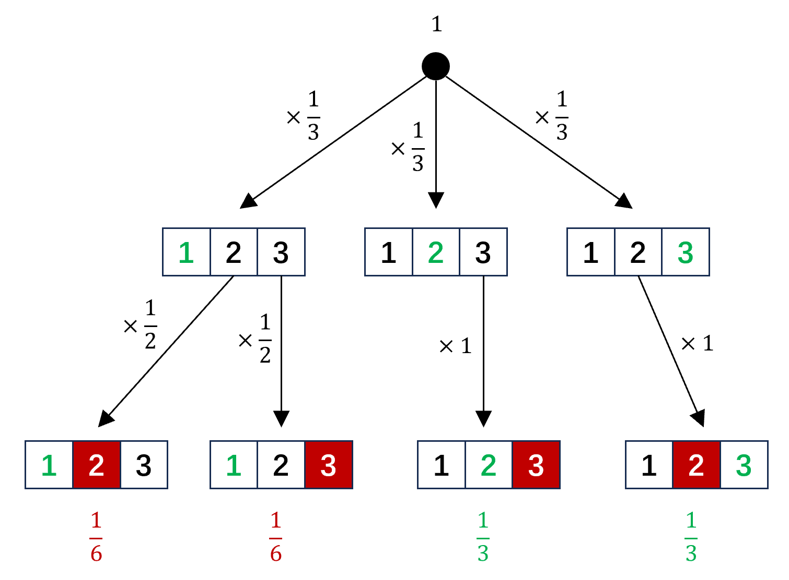
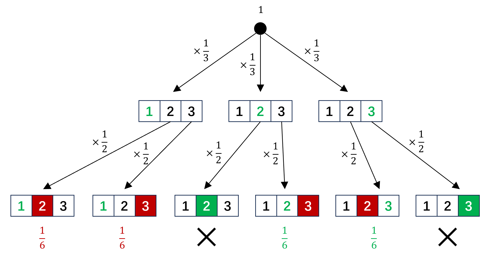

## 前言
最近摸鱼的时候在社媒上刷到了一个有趣的概率问题，叫“三门问题”（又称“蒙提霍尔问题”），引发了我的一些小思考。问题描述是这样的：

> 在一档电视游戏节目中，参与者需要在面前的三扇门中选择一扇门，其中一扇门背后是一辆汽车，选中即可赢得该汽车，而另外两扇门背后各有一只山羊。当参与者选中一扇门但还未开启的时候，主持人会从另外两扇门中开启一扇背后是山羊的门，并问参与者是否要换选另一扇还未开启的门。此时参与者换门是否能提升赢得汽车的概率？

这个问题的答案是肯定的，即换门确实能提升赢得汽车的概率。这是一个有些反直觉的结论，因为已知剩下两扇门中一扇对应汽车，一扇对应山羊，根据直觉，换不换门开出汽车的概率都是50%。

## 分析
对这个问题有多种分析方法可以得到正确的结论。评论区有人给出了一种简单的解释：第一次选择时，选中汽车的概率为 $\frac{1}{3}$，选中山羊的概率为 $\frac{2}{3}$；而在主持人开门以后，换门就意味着山羊和汽车的互换，所以此时换门得到汽车的概率是 $\frac{2}{3}$，换门没有汽车的概率是 $\frac{1}{3}$。

但我认为用另一种方法可能更清晰也更本质一些：假设用户选择的门是1号门，主持人从2号门和3号门中等概率选择一个对应山羊的门打开。那么所有可能的事件构成的树状图如图所示：

  

可以看到换门没有汽车的概率是 $\frac{1}{6}+\frac{1}{6}=\frac{1}{3}$，换门得到汽车的概率是 $\frac{1}{3}+\frac{1}{3}=\frac{2}{3}$。

那么，要怎么解释正确结论与直觉之间的矛盾呢？我个人的看法是，当参与者最终面对“已选中的门”和“剩余的另一个门”这两个选项时，我们的直觉习惯性地认为两个选项具有对称性，没有意识到两个选项的产生过程其实导致了它们并不对等。“已选中的门”并不是从最终的两个门中等概率随机选择得到的，而是由最初的三选一过程产生的；而“剩余的另一个门”则是由最初的三选二再加上主持人的“提纯”产生的，这两个选项的“本质”并不相同。

## 改编
在社媒上，我还看到有人将三门问题的题面描述成了“在参与者选定一扇门后，主持人随机打开另外两扇门中的一扇，发现背后是山羊，并问参与者是否要换门”。实际上，原问题中“主持人知道汽车在哪扇门并且一定会开启背后是山羊的门”这一隐含条件是至关重要的，这里的描述曲解了这一点，导致题意发生了变化。如果照着这个新版的题面分析，答案就发生了变化：

  

可以看到，由于主持人开到汽车的情况被排除掉了，概率对应的条件发生了变化，条件概率也就发生了变化，最终换不换门赢得汽车的概率都是 $\frac{1}{2}$。

对此，我的理解是：主持人进行随机选择的动作引入了一条观测信息——”从参与者未选中的两个门中随机选择一次，选到了山羊“。这条信息启示我们，这两个门包含汽车的概率是偏小的，即参与者最初选中汽车的概率是偏高的。因此将这条信息加入概率的条件后，“已选中的门后是汽车”的概率就从先验概率变成了后验概率，从 $\frac{1}{3}$ 上升到了 $\frac{1}{2}$。