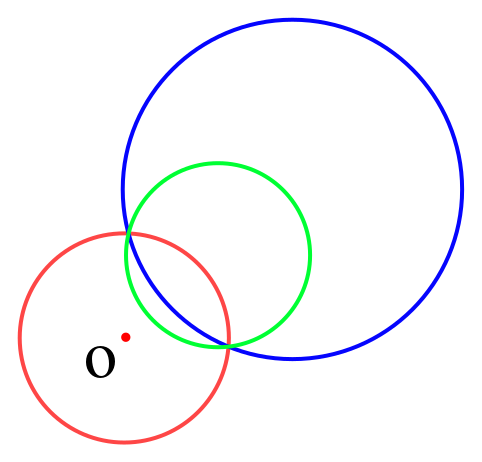

## 简介
反演变换是计算几何中的一种问题转换技巧，可以将平面上一个圆内部和外部的点建立起一一映射关系。

在平面中，给定一个点 $O$ 和一个常数 $k(k\neq 0)$，则对于平面内任意一点 $A$，其反演点 $A'$ 在直线 $OA$ 上，且 $OA\cdot OA'=k$。其中，$O$ 称为反演中心，$k$ 称为反演幂。

## 性质
通常情况下，我们需要自己构造反演中心和反演幂，而反演幂通常被定义为正数，因此以下性质默认以反演幂 $k>0$ 为前提：

1. 以 $O$ 为圆心，$\sqrt{k}$ 为半径的圆称为反演圆，它将平面划分为两部分，反演变换就是在这两部分间建立起的映射关系
2. 反演中心对应无穷远，不存在反演点；反演圆上的点的反演点为其自身
3. 不过 $O$ 的圆，其反演图形也是不过 $O$ 的圆

  

4. 过 $O$ 的圆，其反演图形为一条直线

  

## 应用
反演变换通常用于涉及圆相切关系的问题中，例如将“圆与圆相切”变换为“圆与直线相切”，或将“求一个圆”变换为“求一条直线”。

将反演中心设置在某个圆上即可将该圆变换为直线。

需要注意，若涉及点在圆上的关系，需要引入 $\epsilon$ 来解决精度问题。

---