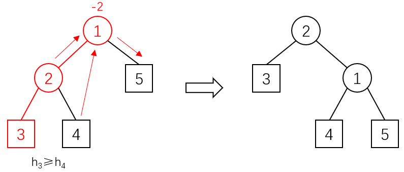
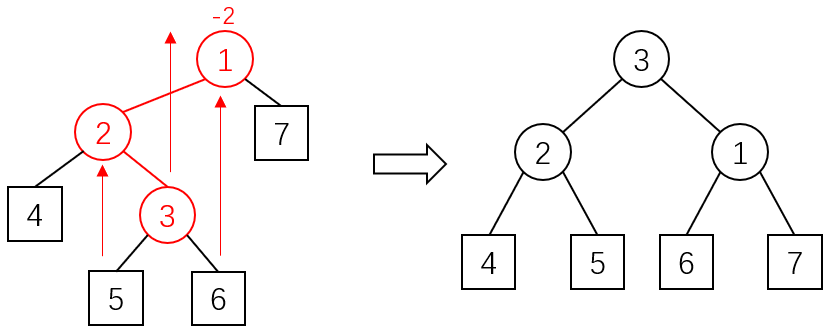

## 1 线性表
线性表是一种逻辑结构，表示元素有之间一对一的相邻关系，对应的存储结构有顺序表、链表。

### 链表
链表的种类：单向链表、双向链表、循环链表、静态链表
  
头结点的作用：
- 第一个元素结点的操作和其他元素的操作一致，不用特殊处理
- 无论链表是否为空，头指针都非空

### 顺序表和链表的对比
顺序表的优点：
- 随机访问
- 不需要存额外信息，存储密度高
- Cache 命中率高（符合局部性原理）

链表的优点：
- 插入删除简单
- 可动态分配空间，不存在空间浪费

### 稀疏矩阵的快速转置
稀疏矩阵一般用三元组存储，所有元素先按行后按列排序。快速转置算法先记录转置后每一行即原来每一列的元素个数，然后计算出每列元素在新表中的首位置，最后按顺序扫描旧表元素，存放在新表对应位置。

### 字符串 KMP 算法
next 数组代表失配时模式串指针的转移目标，同时也是模式串每个前缀的最长前后缀长度，可以递推计算。

## 2 栈和队列
栈和队列也属于线性表，但是支持的操作是线性表的子集。

### 栈
共享栈：利用栈底位置不变性，让两个栈共享一个数组空间

链式栈的特点：
- 无栈满问题，可动态扩充空间
- 插入删除都只需要在链头进行

$n$ 个元素顺序进栈的出栈序列种类数：卡特兰数 $\frac{1}{n+1}C_{2n}^{n}$

### 队列
队列的种类：循环队列、链式队列、双端队列、优先队列

## 3 树
### 二叉树
二叉树：度不超过 $2$ 的树

满二叉树：所有非叶结点都有两个子结点，总结点数为 $2^h-1$

完全二叉树：满二叉树最后一层从右向左缺失部分结点

中序+前序/后序可以唯一确定一棵二叉树，但前序+后序不行。

$n$ 个结点的二叉树种类数：卡特兰数 $\frac{1}{n+1}C_{2n}^{n}$

### 树的表示
广义表：线性表的递归拓展

父指针表示法：记录每个结点的父结点

左子女右兄弟表示法：可将森林转为二叉树

### 堆
堆属于完全二叉树，通常用数组存储，方便父子关系的表达。

堆的调整：建堆和插入时从下往上调整，移除时从上往下调整

## 4 集合与搜索
### 等价类的链表算法
插入 $(i,j)$ 等价关系时，将 $i$ 加入 $j$ 链表，将 $j$ 加入 $i$ 链表；输出时用一个数组记录所有元素是否已输出，然后遍历所有链表，在链表 $x$ 中遍历到元素 $y$ 时递归遍历链表 $y$，即可输出所有与 $x$ 等价的元素，时间复杂度 $O(n+m)$。

### AVL 树
AVL 是一种二叉搜索树，满足每个结点的左子树和右子树高度差（平衡因子）不超过 $1$，在修改后，若平衡被打破，需要进行平衡性旋转恢复平衡。

插入结点时，向上寻找失衡结点，并逐个进行平衡化旋转；对于每个失衡结点，找到回溯路径上其下方的两个结点，若这三个结点呈直线则进行单旋，若呈折线则进行双旋：
- 左单旋/右单旋

  

- 左右双旋/右左双旋

  

删除结点时，向上寻找失衡结点，并逐个进行平衡化旋转；对于每个失衡结点，找到其不在回溯路径上的子结点，若两结点的删除前的平衡因子相差 $0$ 或 $1$ 则进行单旋，若两结点删除前的平衡因子相差 $2$ 则进行双旋：
- 左单旋/右单旋

  

- 左右双旋/右左双旋

  

## 5 图
### 十字链表&邻接多重表
十字链表是针对有向图的一种存图方式。对于每条边，记录其两端的点，以及起点的下一条入边和终点的下一条出边；对于每个点，记录其第一条入边和第一条出边。

邻接多重表是针对无向图的一种存图方式，对于每条边，记录其两端的点，以及两个点的下一条邻接边；对于每个点，记录其第一条邻接边。

### 图的连通性
重连通分量：点双连通分量

关节点：割点

### 最小生成树
Kruskal 算法：选边，稀疏图

Prim 算法：选点，稠密图

### 最短路
Bellman-Ford 算法：任意边权单源最短路

Dijkstra 算法：非负边权单源最短路

Floyd 算法：多源最短路

### 活动网络
找关键路径：先按拓扑序 DP 出最早开始时间，再按逆拓扑序 DP 出最晚开始时间，二者相等的即关键活动

## 6 排序
### 插入排序
直接插入排序：暴力枚举插入位置，$O(n^2)$，稳定

折半插入排序：二分搜索插入位置，$O(n^2)$，稳定

链表插入排序：使用链表存储序列，$O(n^2)$，稳定

希尔排序：选择一个 $gap_0<n$，每次在间隔为 $gap_i$ 的元素之间使用直接插入排序，并设置 $gap_{i+1}=\lceil\frac{gap_i}{2}\rceil$，直到 $gap_m=1$，时间复杂度未知，不稳定

### 交换排序
冒泡排序：从右到左两两交换，使得前缀有序，$O(n^2)$，稳定

快速排序：用双指针将元素划分到基准两侧，分治计算，平均 $O(n\log n)$/最坏 $O(n^2)$，不稳定

### 选择排序
直接选择排序：每次选择最小的交换到左边，$O(n^2)$，不稳定

锦标赛排序：用完全二叉树模拟锦标赛过程，$O(n\log n)$，稳定

堆排序：原地建堆，$O(n\log n)$，不稳定

### 归并排序
普通归并排序：$O(n\log n)$，稳定

链表归并排序：不需要额外空间，$O(n\log n)$，稳定

### 基数排序
最高位优先：先分组再收集，递归分治，$O(d(n+radix))$，稳定

最低位优先：先分组再收集，但不用分治，$O(d(n+radix))$，稳定

### 外排序
待排序信息大于内存容量，需要将部分信息存储在外存上；采用多路归并思想。

---