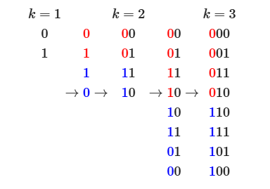

## 简介
格雷码指相邻数的编码只有一位不同的二进制编码系统，有利于减少数字电路在数值连续变化时发生的数位变化。

<div style="text-align: center;">
  
</div>

## 性质
若无特殊说明，格雷码一般指典型格雷码，即一套特定的编码表。以下性质默认针对典型格雷码：
1. 最大数和最小数之间也仅有一位不同
2. 递归对称，即 $n$ 位格雷码表的前半和后半在后 $n-1$ 位上完全对称，而前一半的最高位为 $0$，后一半的最高位为 $1$（根据这一性质可以倍增构造格雷码）
3. 格雷码的递增规律为重复“翻转最低位”和“翻转最低1的高一位”两步骤（根据这一性质可以枚举格雷码）

## 构造
### 变换
$$g(n)=n\oplus\lfloor\frac{n}{2}\rfloor$$

```cpp
int g(int n) { return n ^ (n >> 1); }
```

### 逆变换
$$g^{-1}(n)=\bigoplus_{i=0}^{\lfloor\log_2 n\rfloor} \lfloor\frac{n}{2^i}\rfloor$$

```cpp
int inv_g(int g)
{
    int n = 0;
    while (g)
    {
        n ^= g;
        g >>= 1;
    }
    return n;
}
```

### 枚举
```cpp
int cur = 0;
for (int i = 0; i < (1 << n); ++i)
{
    if (i % 2) cur ^= (cur & -cur) << 1;
    else cur ^= 1;
}
```

---